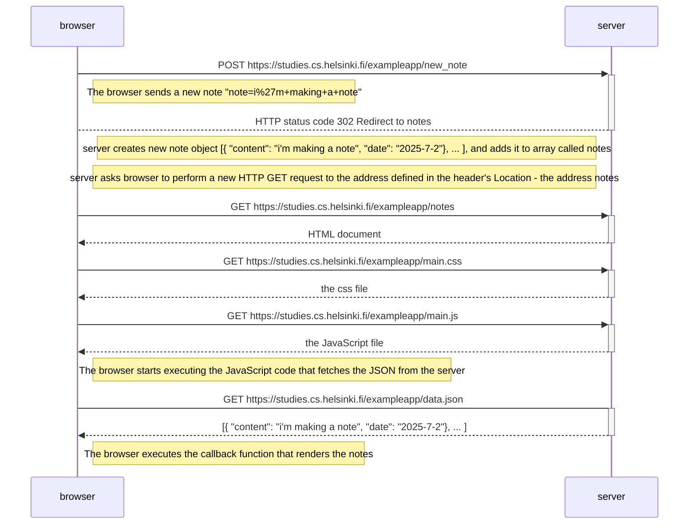

```mermaid

sequenceDiagram
        participant browser
        participant server

        browser->>+server: POST https://studies.cs.helsinki.fi/exampleapp/new_note
        Note right of browser: The browser sends a new note "note=i%27m+making+a+note"
        server-->-browser: HTTP status code 302 Redirect to notes
        Note left of server: server creates new note object [{ "content": "i'm making a note", "date": "2025-7-2"}, ... ], and adds it to array called notes
        Note right of browser: server asks browser to perform a new HTTP GET request to the address defined in the header's Location - the address notes

        browser->>+server: GET https://studies.cs.helsinki.fi/exampleapp/notes
        server-->>-browser: HTML document
        browser->>+server: GET https://studies.cs.helsinki.fi/exampleapp/main.css
        server-->>-browser: the css file
        browser->>+server: GET https://studies.cs.helsinki.fi/exampleapp/main.js
        server-->>-browser: the JavaScript file
        Note right of browser: The browser starts executing the JavaScript code that fetches the JSON from the server
        browser->+server: GET https://studies.cs.helsinki.fi/exampleapp/data.json
        server-->>-browser: [{ "content": "i'm making a note", "date": "2025-7-2"}, ... ]
        Note right of browser: The browser executes the callback function that renders the notes

```
