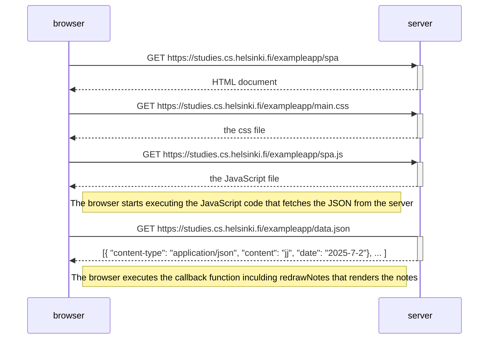

```mermaid

sequenceDiagram
        participant browser
        participant server

        browser->>+server: GET https://studies.cs.helsinki.fi/exampleapp/spa
        server-->>-browser: HTML document
        browser->>+server: GET https://studies.cs.helsinki.fi/exampleapp/main.css
        server-->>-browser: the css file
        browser->>+server: GET https://studies.cs.helsinki.fi/exampleapp/spa.js
        server-->>-browser: the JavaScript file
        Note right of browser: The browser starts executing the JavaScript code that fetches the JSON from the server
        browser->+server: GET https://studies.cs.helsinki.fi/exampleapp/data.json
        server-->>-browser: [{ "content-type": "application/json", "content": "jj", "date": "2025-7-2"}, ... ]
        Note right of browser: The browser executes the callback function inculding redrawNotes that renders the notes

```
